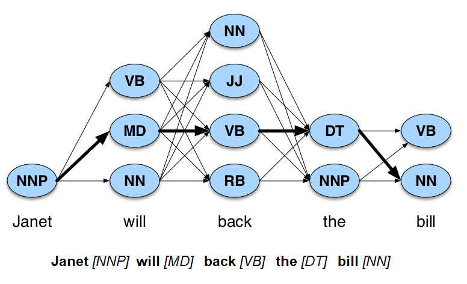
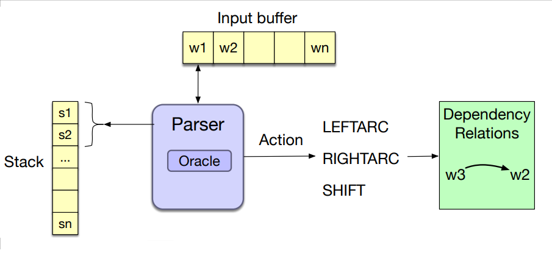
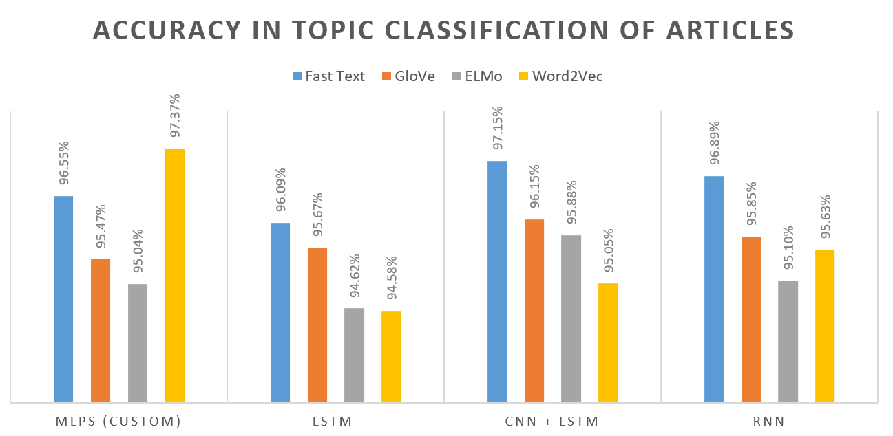
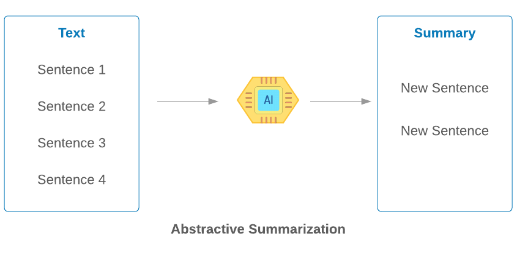

# Portfolio
---
## Natural Language Processing
### [NLP] Building Part of Speech (POS) tagger with Hidden Markov Model using Viterbi  algorithm

**This is my completed project about POS Tagging** __*Achieved over 95% accuracy*__

**Part-of-Speech** (POS) *(noun, verb, and preposition)* can help in understanding the meaning of a text by identifying how different words are used in a sentence. POS can reveal a lot of information about neighbouring words and syntactic structure of a sentence.

**The Hidden Markov Models (HMM)** is a statistical model for modelling generative sequences characterized by an underlying process generating an observable sequence.

*POS tagging Models* which are *probabilistic sequence models*.

  

---

### [NLP] Building a Transition Based Dependency Parsing

**Transition-based dependency parsing**: is a fast and effective approach for dependency parsing. Traditionally, a transitionbased dependency parser processes an input sentence and predicts a sequence of parsing actions in a left-to-right manner.

Successfully built a complete model with detailed running steps. You can refer to the details in the code section, Model currently has 45 Postags, 94084 tokens and total 349 dependency arcs

  

---

### [NLP] Evaluation of the quality of word embedding models for Vietnamese (GloVe, Word2Vec, ELMO, FASTTEXT)

**This is a research project that got a highest score in my and a friend's natural language processing course on evaluating the quality of Word embeddings models for Vietnamese.**

The main task focuses on **evaluating the quality of Words Embedding models** Including: **GloVe, Word2Vec, ELMO, FASTTEXT**

To ensure fairness for the evaluation process. The model will be passed 2 criteria: 
- **Accuracy scores**
- **Convergence speed when training through loss**

In addition, the evaluation process also takes place on **4 different models:**

  

*The chart describes in detail the accuracy measured on the test set of the embedding sets on each classification model*

  

*Example Graph of loss function of word-embedding models compared from 1st model MLPs (custom)*

---
### [NLP] Deep Text Abtractive Summarization of Vietnamese news using GAN

**Abstractive Text Summarization**: is the task of generating a short and concise summary that captures the salient ideas of the source text. The generated summaries potentially contain new phrases and sentences that may not appear in the source text

Within the scope of this project, I do it on *crawled data from Vietnamese news stories and label them as empty news* (the news has been summarized by the station).

  

---

### [NLP] Building a Vietnamese Language model with Tensorflow (keras)

**A Vietnamese language model**: is a probabilistic statistical model that determines the probability of a given sequence of words occurring in a sentence based on the previous words. It helps to predict which word is more likely to appear next in the sentence.

*This is a model built for the purpose of understanding the structure of the language model. So will not focus on accuracy (because the dataset is small under 10k words)**

  <

---
## Computer Vision & Digital Image Processing
### [CV & DIP] Building an OCR to Extract Info from Identity Cards

This is an integrated system of **advanced image processing methods in image preprocessing** and the application of **Tesseract (Open Source OCR Engine)**.
Gives about *90-92% accuracy manually evaluated on 300 images*

**The current model has the following functions:**
- Adjust the size and drag the 4 sides perpendicularly even when taking photos at an angle (no more than 45 degrees)
- Self-recognize both sides of an ID card (new and old model)
- Crop the part of the photo containing the information (text) on the identity card
- Extract identifiable information into text

  

---
### [DIP] Adaptive Thresholding using the Integral Image

This is my implementation of an adaptive focusing technique applied in real-time image processing (streaming). The method suggested in a paper entitled Adaptive [Thresholding using the Integral Image](https://www.researchgate.net/publication/220494200_Adaptive_Thresholding_using_the_Integral_Image) in my master's program.

-This method has solved the problem of the **change in brightness in a photo**. This method uses adaptive thresholding. The key is that each pixel in the image is assigned a different threshold value. There are many methods for getting the upper threshold, but within the scope of the article above, we will mention **using an integral image**.

  

---
## Machine Learning
### [ML] Building a Classification Model that predicts the shopping behavior of online shoppers

**This is a model built to predict buying decisions of online shoppers** which purpose is to help identify a customer who does not purchase but still participates in the wrong shopping to offer the right ads for them and to analyze the buying behavior of the vast majority of users. 

**The process includes:**
- Data preprocessing _(numerical data, categorical data)_
- Select data features according to Mrmr . method
- The model is used 3 classification methods: _MLP, Decision Tree C4.5 and random forest_

                                                             

---

### [ML] Building Robot Vacuum Cleaner Operation Simulator using Java

**This is my first project in the field of AI with a close friend**

The project was once proposed by some teachers in the faculty to the school to ask for a sum of money to actualize the robot into a physical version. But technically, assembling the machine was difficult, so this project was temporarily shelved.

https://user-images.githubusercontent.com/55480300/178575965-b4d72ee8-bd24-4299-b806-75a2195afdff.mp4
