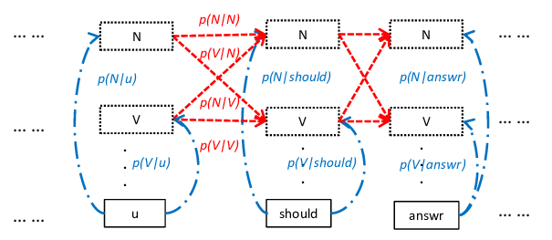

# Portfolio
---
## Natural Language Processing
### [NLP] Building a Part of Speech Tagger (POS) Using Viterbi

**This is my completed project about POS Tagging** __*Achieved over 95% accuracy*__

**Part-of-Speech** (POS) *(noun, verb, and preposition)* can help in understanding the meaning of a text by identifying how different words are used in a sentence. POS can reveal a lot of information about neighbouring words and syntactic structure of a sentence.

**The Hidden Markov Models (HMM)** is a statistical model for modelling generative sequences characterized by an underlying process generating an observable sequence.

*POS tagging using Hidden Markov Models (HMMs)* which are *probabilistic sequence models*.

---
### [NLP] Building a Transition Based Dependency Parsing
**Transition-based dependency parsing**: is a fast and effective approach for dependency parsing. Traditionally, a transitionbased dependency parser processes an input sentence and predicts a sequence of parsing actions in a left-to-right manner.

Successfully built a complete model with detailed running steps. You can refer to the details in the code section, Model currently has 45 Postags, 94084 tokens and total 349 dependency arcs

---
### [NLP] Evaluation of the quality of word embedding models for Vietnamese (GloVe, Word2Vec, ELMO, FASTTEXT)

---
### [NLP] Deep Text Abtractive Summarization of Vietnamese news using GAN

---
### [NLP] Building a Vietnamese Language model with Tensorflow (keras)

---
## Digital Image Processing & Computer Vision
### [CV] Building an OCR to Extract Info from Identity Cards

---
### [DIP] Adaptive Thresholding using the Integral Image

